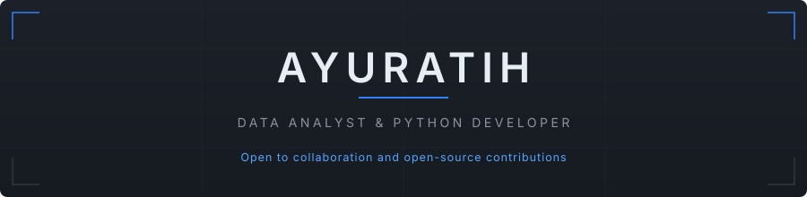

  

## About Me

  Saya <strong>Ayuratih</strong>, sedang mengeksplorasi teknologi baru, menulis kode, dan mencari cara menyelesaikan
  masalah secara kreatif. Fokus saya saat ini adalah <strong>Python</strong> untuk pemrograman dan
  <strong>data analysis</strong>.

  Terbuka untuk kolaborasi di proyek open-source maupun solusi teknologi inovatif.

## GitHub Statistics

  
  

## Contribution Graph

  

## GitHub Streak

  

## Featured Projects

| Project | Description | Tech |
|:--|:--|:--|
| [cekidots](https://github.com/ayuratih425/cekidots) | Aplikasi web dengan role-based access control, seeding data, dan test otomatis | Laravel 10 · PHP 8.3 · PostgreSQL · Pest |
| [Tugas Pemrograman Web](https://github.com/ayuratih425/Tugas_PemrogramanWeb_Ratih) | Tampilan login dan registrasi dasar, [_live demo_](https://tugas-pemrograman-web-ratih.vercel.app) | HTML · CSS |
| [PT-SOYUZ](https://github.com/ayuratih425/PT-SOYUZ) | Kumpulan tugas web mata kuliah Sematik (IT) | HTML · CSS |

## Currently Learning

- **Python** untuk data analysis & scientific computing
- **Pandas · NumPy · Matplotlib** untuk pengolahan dan visualisasi data
- **SQL & PostgreSQL** untuk query dan basis data relasional
- **Django · Flask** untuk pengembangan web backend
- **Machine Learning** dasar

## Connect With Me

  
  
  

  

